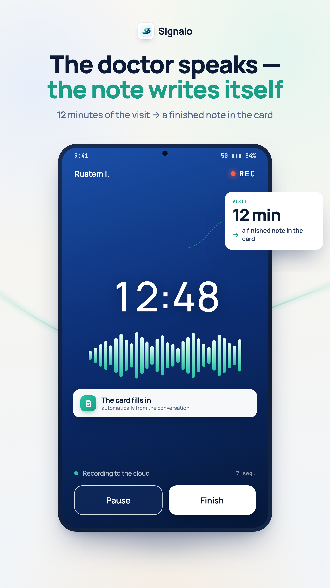
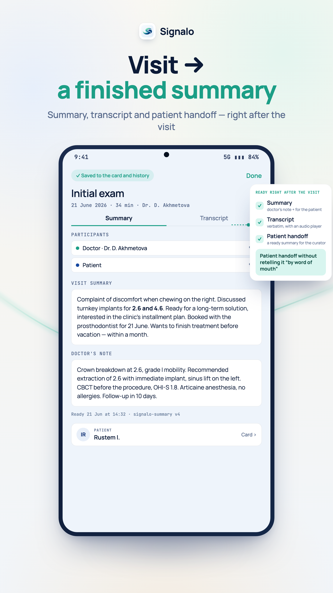
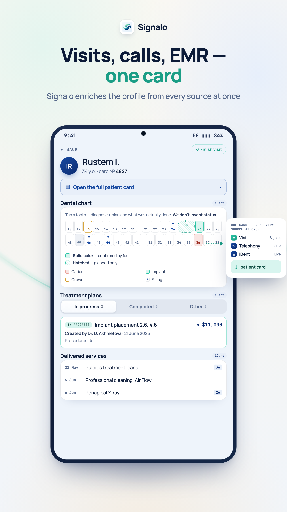
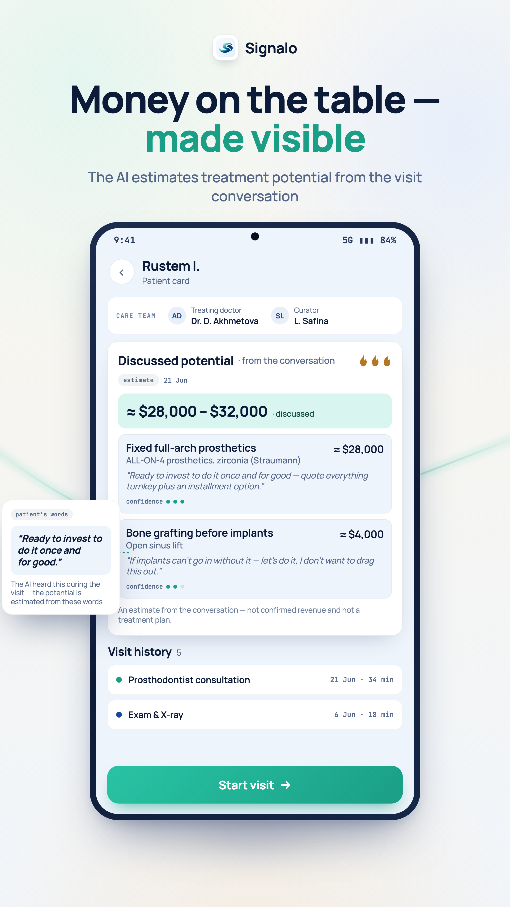
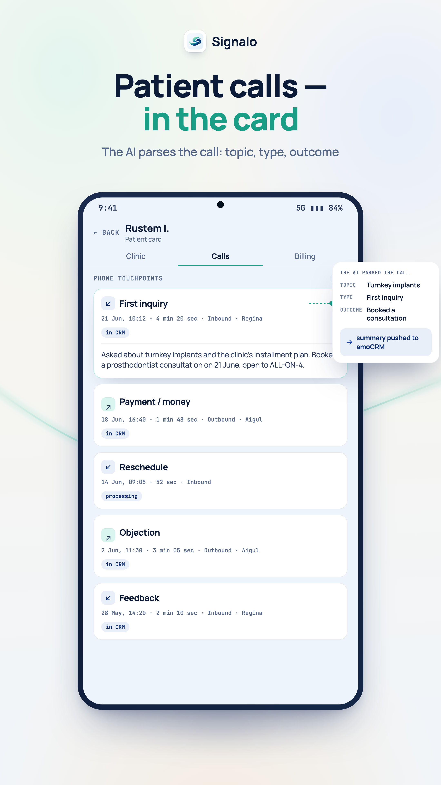
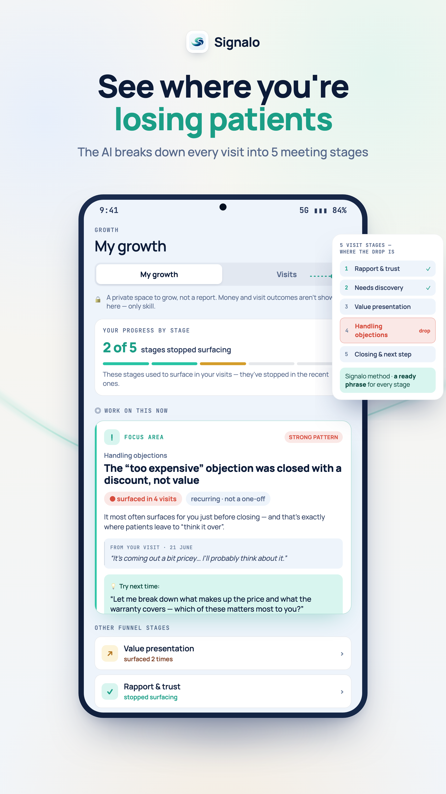
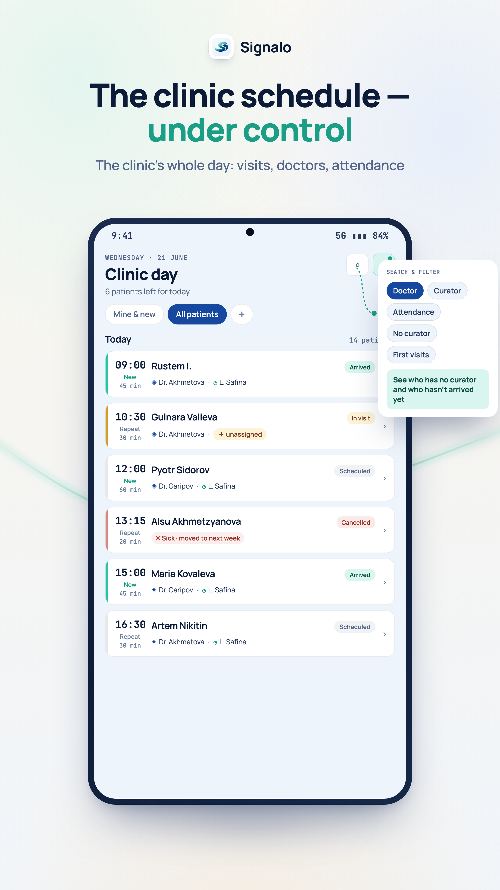
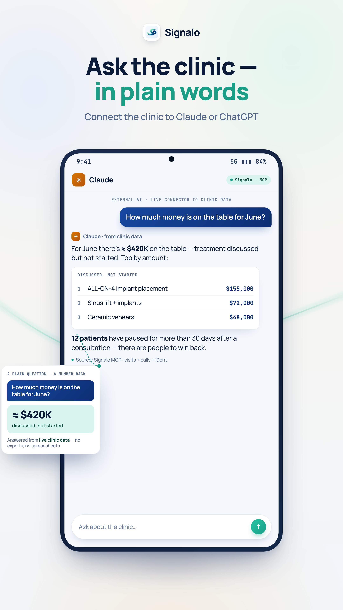
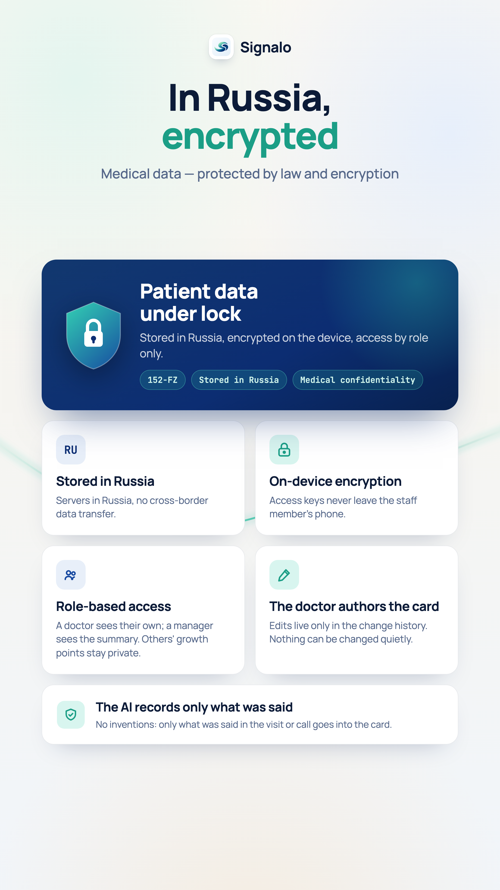

# Signalo — AI for clinical conversations

Signalo records a doctor's visit with a patient, transcribes it, and turns it into a structured medical
note, coaching feedback for the clinic's coordinators, and analytics for the owner. First market: dental
clinics. It runs in production, in a real, paying clinic, every day.

I built it end to end, on my own: the product, the mobile apps, the backend, the AI pipeline, and the
integrations with the clinic's existing software.

**This repo describes the architecture and the engineering. The product's own source stays private** —
it holds patient data and it's a live commercial product. What's here is the story of what it does and
how it's built.

### Proof, not just prose

Reviewing this to hire? Don't take the prose on faith — here are the artifacts:

| | |
|---|---|
| 🧭 **[INTERVIEW_GUIDE.md](./INTERVIEW_GUIDE.md)** | Start here: 5 files, 5 questions, 5 real trade-offs. A fast path for a busy reviewer. |
| 📐 **[architecture/](./architecture)** | System, recording state machine, auth flow, AI pipeline, deployment — as diagrams (render on GitHub). |
| 💻 **[sanitized-code/](./sanitized-code)** | Representative extracts of the real code: the stuck-job reaper, device-bound refresh rotation, the LLM coverage guard. |
| 🔧 **[incidents/](./incidents)** | Postmortems: the false-logout bug that recurred 8× and a GPU pipeline quietly burning money. |
| 🧪 **[evals/](./evals)** | How a model change is stopped from silently degrading a clinical note — the grading rubric and gates. |

*What's public here / what stays private:* the product source, patient data, and
live integrations stay private; everything above is sanitized — shapes and
reasoning are real, client names/hosts/secrets are removed.

---

## The product, in screens

Nine screens from the production mobile app — localized to English for this showcase (the product ships in Russian for its market). Demo data throughout; no real patient information.

<table>
<tr>
<td width="33%" align="center"><br><b>Record the visit</b><br><sub>The doctor speaks; the structured note writes itself. Resumable, survives a dropped connection.</sub></td>
<td width="33%" align="center"><br><b>Finished in minutes</b><br><sub>A visit summary, the doctor's note, and the full transcript — ready right after the visit.</sub></td>
<td width="33%" align="center"><br><b>One card</b><br><sub>Visits, calls and the clinic's EMR — dental chart, treatment plans, delivered services — unified.</sub></td>
</tr>
<tr>
<td width="33%" align="center"><br><b>Money on the table</b><br><sub>AI estimates treatment potential from the conversation — with the patient's own words as evidence.</sub></td>
<td width="33%" align="center"><br><b>Calls in the card</b><br><sub>Phone touchpoints parsed by AI — topic, type, outcome — and pushed back to the CRM.</sub></td>
<td width="33%" align="center"><br><b>Coaching that lands</b><br><sub>Per-clinician: where a consult loses the patient, and a ready phrase for next time.</sub></td>
</tr>
<tr>
<td width="33%" align="center"><br><b>The clinic day</b><br><sub>The schedule with attendance statuses and filters — the day at a glance.</sub></td>
<td width="33%" align="center"><br><b>Ask the clinic</b><br><sub>An external AI (Claude, ChatGPT) answers live clinic questions through a read-only connector.</sub></td>
<td width="33%" align="center"><br><b>Healthcare-grade</b><br><sub>Data residency, on-device encryption, role-based access — and it records only what was said.</sub></td>
</tr>
</table>

<sub>Reproducible: the English screen sources live in <a href="screens/src/mobile/"><code>screens/src/mobile/</code></a>.</sub>

---

## The problem it solves

A clinic loses two things it can never get back: what was actually said in the room, and why a lead
didn't become a patient.

- **Doctors** spend half the visit typing instead of listening, and still forget details by evening.
- **Coordinators** talk to a lead, the lead doesn't book, and there's no record of what went wrong.
- **Owners** are flying blind: which doctor converts, which coordinator drops the ball, whether anyone
  follows the protocol.

Signalo captures the conversation and turns it into something the clinic can actually use — a clean note
in the chart, honest feedback on the call, and numbers the owner can act on.

## Who uses it

- **The doctor** presses record at the start of the visit and forgets about it. By the end there's a
  structured note waiting — complaints, findings, plan — that they check and sign instead of typing from
  scratch.
- **The coordinator** gets feedback on their calls with leads: what they did well, what they missed, what
  to follow up on.
- **The owner** gets a live picture of the clinic — revenue, conversion, no-shows, idle chairs — without
  chasing anyone for a report.

---

## At a glance

| | |
|---|---|
| **Scope** | iOS app, Android app, web portal, backend, and GPU workers — built from zero in about three months |
| **Codebase** | ~550,000 lines — TypeScript (backend + web), Swift (iOS), Kotlin (Android), Python (GPU inference) |
| **Speech-to-text** | A GPU speech model (GigaAM-v3) running on rented GPU workers, with speaker separation |
| **The AI note** | Structured medical notes and coaching generated by large language models, with guardrails against making things up |
| **Integrations** | The clinic's practice-management system (schedule + patients), a CRM, and a connector that lets an AI assistant answer live questions about the clinic |
| **The bar** | Healthcare-grade — patient-data protection, sign/lock/addendum records, audit trails, right-to-be-forgotten |

*(No client business numbers are published here — revenue and conversion belong to the clinic. What's
above is about the product and the engineering.)*

---

## How it works, end to end

```
  Doctor's phone / tablet / web
        │   record the visit — uploaded in small chunks, resumable, survives a dropped connection
        ▼
   Backend API  ──►  PostgreSQL · Redis · object storage (the audio)
        │
        ▼
   Background workers  ──►  GPU speech-to-text
        │                     ├─ transcribe the audio
        │                     └─ separate the speakers, then correct that with a language model
        ▼
   The AI pipeline
        ├─ a structured medical note
        ├─ coaching feedback for the coordinator
        └─ an auto-note pushed into the CRM
        │
        ▼
   The clinic's systems (practice-management, CRM) · a live-analytics connector for AI assistants
```

Every arrow in that diagram is a place something can go wrong — a dropped upload, a GPU worker dying
mid-job, a model inventing a detail that was never said. Most of the engineering below is about making
each of those steps reliable and honest.

---

## What it actually does

### Recording that survives the real world
The doctor records a whole visit on a phone. The audio uploads in small chunks as it goes, so a
15-minute visit isn't one giant file at the end. If the connection drops or the app is backgrounded, it
picks up where it left off. If a recording gets stuck halfway (the app was killed, the phone died), a
server-side reaper finds it and finalizes it instead of leaving it lost forever. There's also a web
recorder for the desktop, with the same resume-and-recover behavior.

### Speech-to-text on GPUs
The audio goes to a speech model running on rented GPU workers. This isn't a cloud API call — running
the model myself means control over cost, language quality, and privacy. The workers scale down to zero
when there's no work, so idle GPUs don't burn money.

### Speaker identity done right
Basic speaker separation can tell you "speaker A" and "speaker B" in one recording. It can't tell you
*who* they are, or keep them straight across visits. Signalo enrolls a voice fingerprint for each staff
member and matches against it — so "the doctor" is the same person every time, not a fresh anonymous
label. A language-model pass then cleans up the speaker labels, and that pass is measured before it's
turned on, not assumed to help.

### The medical note
The transcript becomes a structured note: complaints, findings, plan. The hard part isn't generating
text — it's keeping the note *honest*. A language model, left alone, will happily invent a tidy clinical
detail that was never said. Signalo has guardrails so the note reflects what actually happened, and it
self-heals if a generation step fails instead of silently shipping a broken note.

### The patient card
Notes live in a patient card that follows real medical rules: a note is signed, then locked, and after
that it can only be changed by an addendum — the original is never quietly rewritten. Every access is
audited. This is the difference between "an app that stores text" and "a medical record."

### Coaching for coordinators
The same pipeline listens to coordinator-lead calls and produces honest feedback — what was handled
well, what was missed, what to follow up. It's how a clinic turns lost leads into a coaching signal
instead of a mystery.

### Signalo Smile
An iPad kiosk feature: it shows a patient a preview of their potential smile. A capture step frames the
face, and the result is shown full-screen. Getting this right taught a sharp lesson — fix a bad photo at
the source (reframe the capture) instead of cropping and upscaling a low-quality one afterward.

### Integrations with what the clinic already uses
- **The practice-management system** — Signalo syncs the schedule and patient list, so a recording lands
  on the right patient automatically. This runs through a small agent installed on the clinic's own
  network.
- **The CRM** — after a call, an auto-note is pushed into the right deal, so the coordinator's follow-up
  lives where they already work.
- **A live-analytics connector** — an AI assistant (Claude, ChatGPT) can answer real questions about the
  clinic — revenue, conversion, no-shows, idle chairs — by querying live data through a read-only
  connector, with proper auth. 25 analytics tools, read-only by design.

### Platform under all of it
Auth with refresh tokens (and a hard-won discipline about never logging a user out by mistake — see
below), feature flags for safe rollout, object storage for audio, error monitoring and health checks,
push notifications, and a real right-to-be-forgotten implementation — not a promise, actual deletion.

---

## The hard problems worth talking about

These are the parts a senior engineer would ask about. Real trade-offs, not a feature list.

**Cost control as a real feature.** Every language-model call is priced and tracked per call. GPU
workers scale to zero. Anything a plain regex can do deterministically doesn't get an expensive model
call. This isn't premature optimization — a mis-tuned GPU setup once burned about \$20 a day, and the fix
(cheaper cards + scale-to-zero) is exactly the kind of thing you only catch if you're watching the spend.

**Silent failures are the enemy.** The most dangerous bug in a data pipeline is the one that looks like
success. A step that returns "0 results" when it actually means "couldn't check." A cleanup job that
deletes the data it was meant to protect. Signalo has a dedicated review pass — and now an automated
gate — that treats any swallowed error as a defect. "Couldn't verify" must never show up as "nothing
there."

**The "false logout" saga.** Users getting kicked out of the app mid-visit was the most expensive
recurring bug — it came back eight times. The cause was almost never the server. It was a cold-start read
failing quietly and minting a new device identity the server then rejected; a token-refresh loop that
spun forever. The fix was a principle: only log someone out when the session is *positively* dead, never
on a network hiccup — and diagnose from the real token records before theorizing.

**Keeping a medical note honest.** Covered above, but it's worth repeating: the whole product is
worthless if the note contains things that weren't said. Guardrails against hallucination aren't a nice-
to-have here; they're the product.

## How it's built

Signalo was built by one person at the pace of a small team, because the engineering process itself is
AI-orchestrated: a library of reusable skills, a fleet of specialist review agents, and automated gates
that block a bad deploy before it ships. That system is documented separately — see the
**[ai-engineering-showcase](../ai-engineering-showcase)** repo. It's the part I'm most convinced is the
right way to build.

## What I'd walk through in an interview

- Handling two people talking over each other on a phone call — detecting it and getting the transcript right
- Keeping a medical note honest when the model wants to invent structure
- Building an eval harness so swapping a model can't silently make the summaries worse
- Running production for a real, paying clinic, solo: reliability, being on call, and the privacy bar

---

*Built by Rustem Idiatullin — founder and hands-on engineer. Building AI products for healthcare;
relocating to Australia or New Zealand.*
