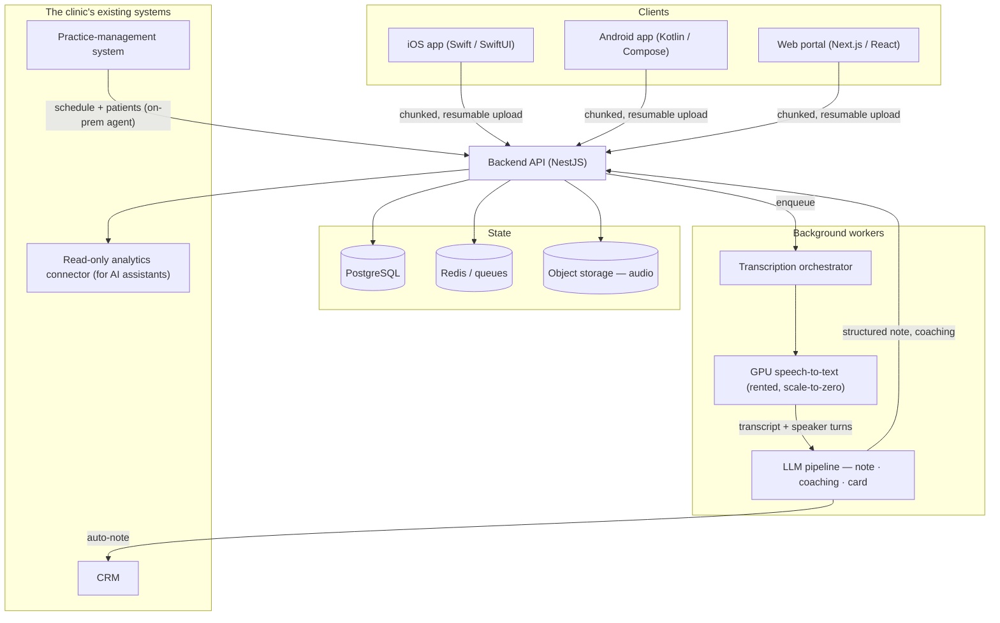
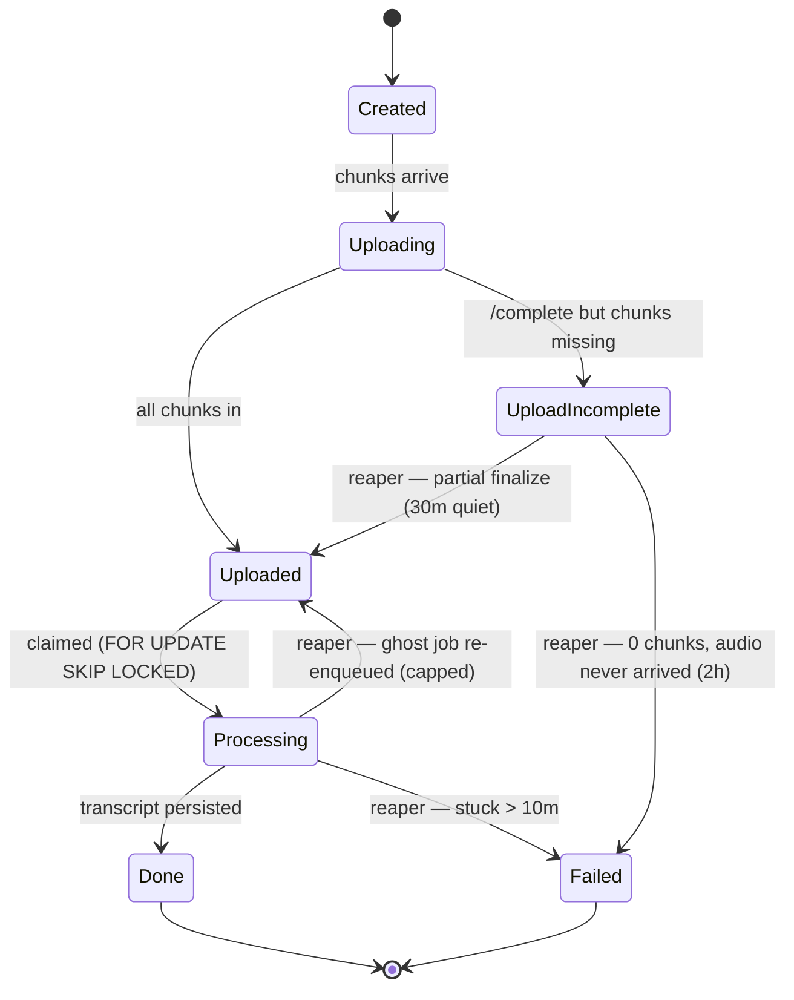
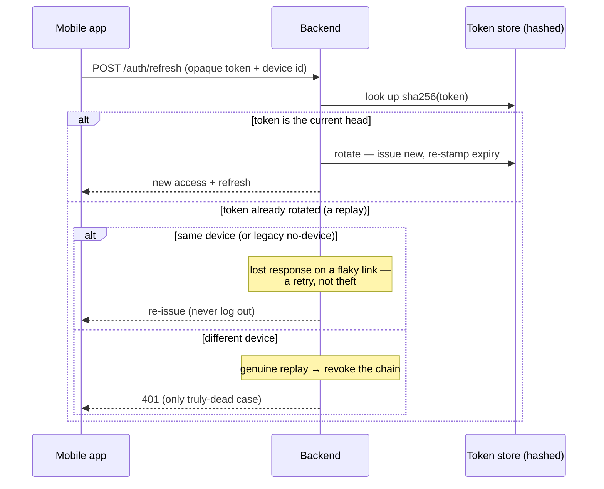
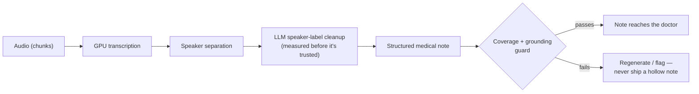
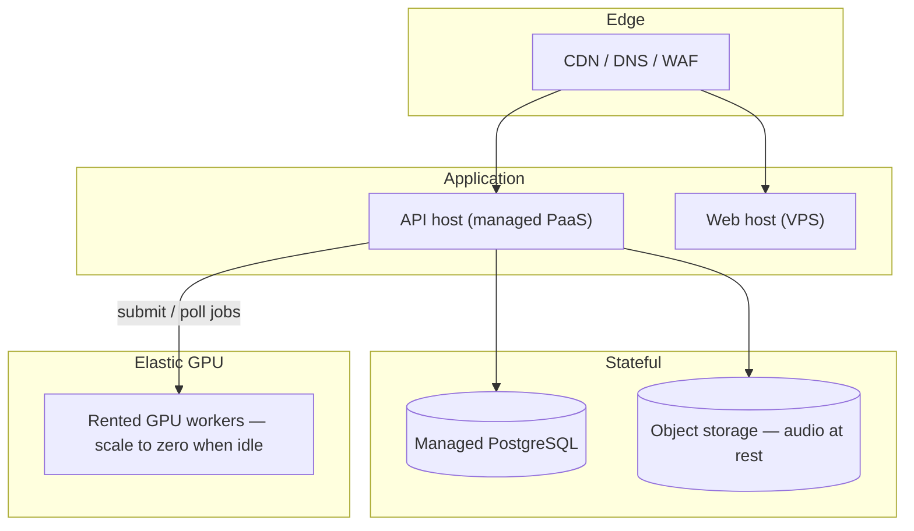

# Architecture

A tour of how Signalo is put together, at the level a senior engineer would want
before an interview. Every diagram renders on GitHub (Mermaid). The product's own
source stays private — this describes the shape and the reasoning, not the secrets.

---

## System, end to end

Every arrow is a place something can fail — a dropped upload, a worker killed
mid-job, a model inventing a detail. Most of the engineering is about making each
step **reliable and honest**, not about the happy path.

---

## The recording lifecycle — a state machine

The single most important invariant: **a recording is never silently lost.** It
either reaches the doctor as a finished note or as an honest failure — never an
eternal spinner. That is enforced by a state machine plus an always-on reaper that
resolves anything stuck (see [`../sanitized-code/stuck-recording-reaper.ts`](../sanitized-code/stuck-recording-reaper.ts)).

Why a reaper and not just retries: a process killed by a rolling deploy between
"claim" and "poll terminal status" leaves a row `Processing` forever. Nothing
in the request path will ever touch it again. A separate, always-on sweeper is the
only thing that can. It measures age by a **durable marker stamped once at claim**,
not by `updatedAt` — because a poll-tick that keeps bumping `updatedAt` would keep a
genuinely-stuck row looking "fresh" forever. That distinction is the whole bug class.

---

## Auth — and the discipline of never logging a user out by mistake

"False logout" (a user booted mid-visit despite a valid session) was the most
expensive recurring bug in the product's history — it came back eight times. The
fix was a principle enforced in code: **only end a session when it is positively
dead, never on a network hiccup.**

The refresh token is stored only as a `sha256` hash, rotates on every use, and its
expiry is re-stamped on each refresh — so an active daily user's session is
effectively perpetual, and the only real defence against a lost device is the
Face ID / passcode gate, not a short token TTL. Sanitized implementation:
[`../sanitized-code/refresh-token-rotation.ts`](../sanitized-code/refresh-token-rotation.ts).

---

## The AI pipeline — honest by construction

The hard part of a medical note isn't generating text — it's keeping it *honest*.
A language model, left alone, will happily invent a tidy clinical detail that was
never said, or summarize the first three minutes of a forty-minute visit and call
it done. Two guards run before any note is shown: a **grounding** check (does the
note reflect what was actually said?) and a **coverage** check (does the output
span the full duration of the source, not just the opening?). See
[`../sanitized-code/llm-note-coverage-guard.ts`](../sanitized-code/llm-note-coverage-guard.ts)
and [`../evals/`](../evals) for how model changes are measured before they ship.

---

## Deployment topology

One deploy command ships the API, the web portal, and the edge config, then runs
health checks against all of them — a deploy isn't "done" until every surface
reports healthy. GPU workers are rented and **scale to zero** when there's no work,
so idle GPUs don't burn money (a mis-tuned setup once cost real money per day — see
[`../incidents/gpu-cost-blowup.md`](../incidents/gpu-cost-blowup.md)).

---

*These diagrams are sanitized and representative — the shapes and trade-offs are
real; client names, hosts, and secrets are removed.*
